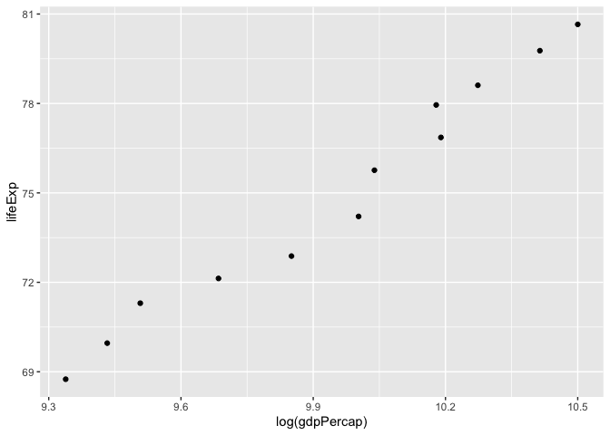
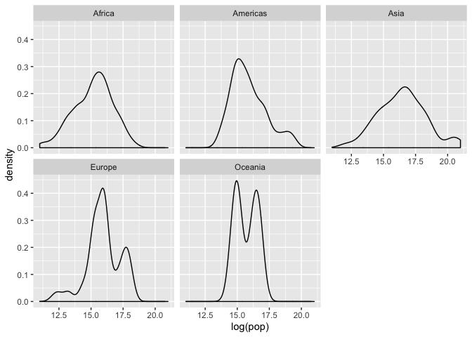
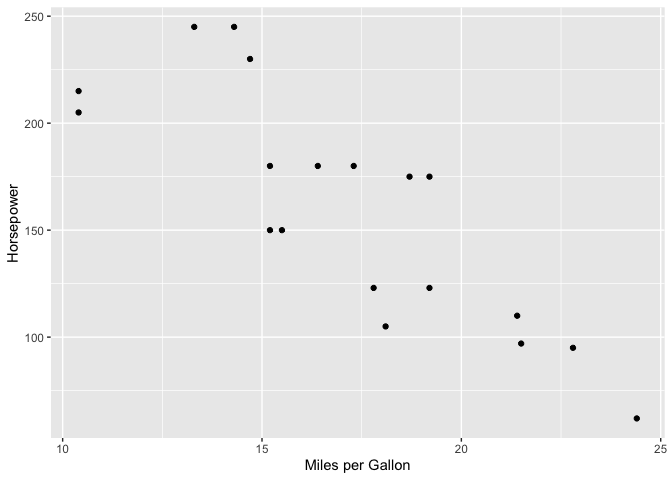
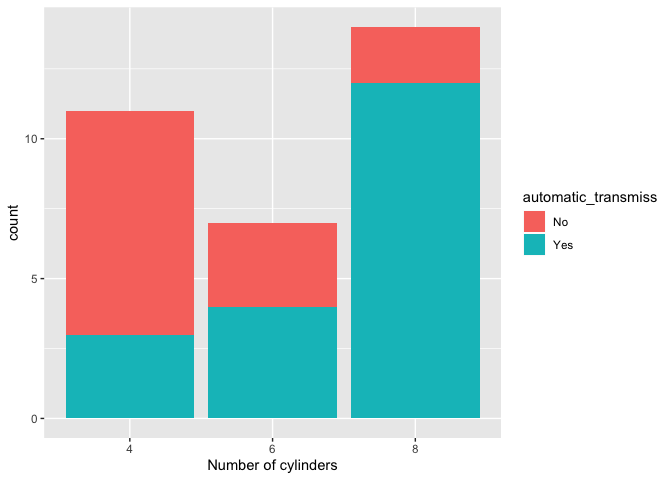

Hw02-Explore Gapminder and use dplyr
================
Almas K.
2019-09-20

Excercise 1:
============

1.1 Filter for selected 3 countries in the 1970s
------------------------------------------------

``` r
kable(
  gapminder %>% 
  filter(year >= 1970 & year <= 1979, country == "Canada"|country == "Sweden"|country == "Pakistan"))
```

| country  | continent |  year|  lifeExp|       pop|  gdpPercap|
|:---------|:----------|-----:|--------:|---------:|----------:|
| Canada   | Americas  |  1972|   72.880|  22284500|  18970.571|
| Canada   | Americas  |  1977|   74.210|  23796400|  22090.883|
| Pakistan | Asia      |  1972|   51.929|  69325921|   1049.939|
| Pakistan | Asia      |  1977|   54.043|  78152686|   1175.921|
| Sweden   | Europe    |  1972|   74.720|   8122293|  17832.025|
| Sweden   | Europe    |  1977|   75.440|   8251648|  18855.725|

1.2 Select country and gdpPercap from 1.1 dataset
-------------------------------------------------

``` r
kable(
gapminder %>% 
filter(year >= 1970 & year <= 1979, country == "Canada"|country == "Sweden"|country == "Pakistan") %>%
select(country, gdpPercap))
```

| country  |  gdpPercap|
|:---------|----------:|
| Canada   |  18970.571|
| Canada   |  22090.883|
| Pakistan |   1049.939|
| Pakistan |   1175.921|
| Sweden   |  17832.025|
| Sweden   |  18855.725|

1.3 Filter gapminder to all entries that have experienced a drop in life expectancy.
------------------------------------------------------------------------------------

``` r
  gapminder %>%
  group_by(country) %>%
mutate(increaseLifeExp=lifeExp-lag(lifeExp)) %>%
  filter(increaseLifeExp<0)
```

    ## # A tibble: 102 x 7
    ## # Groups:   country [52]
    ##    country  continent  year lifeExp     pop gdpPercap increaseLifeExp
    ##    <fct>    <fct>     <int>   <dbl>   <int>     <dbl>           <dbl>
    ##  1 Albania  Europe     1992    71.6 3326498     2497.          -0.419
    ##  2 Angola   Africa     1987    39.9 7874230     2430.          -0.036
    ##  3 Benin    Africa     2002    54.4 7026113     1373.          -0.371
    ##  4 Botswana Africa     1992    62.7 1342614     7954.          -0.877
    ##  5 Botswana Africa     1997    52.6 1536536     8647.         -10.2  
    ##  6 Botswana Africa     2002    46.6 1630347    11004.          -5.92 
    ##  7 Bulgaria Europe     1977    70.8 8797022     7612.          -0.09 
    ##  8 Bulgaria Europe     1992    71.2 8658506     6303.          -0.15 
    ##  9 Bulgaria Europe     1997    70.3 8066057     5970.          -0.87 
    ## 10 Burundi  Africa     1992    44.7 5809236      632.          -3.48 
    ## # … with 92 more rows

1.4 Filter gapminder so that it shows the max GDP for each country:
-------------------------------------------------------------------

``` r
gapminder %>% 
group_by(country) %>%
  summarize(max(gdpPercap))
```

    ## # A tibble: 142 x 2
    ##    country     `max(gdpPercap)`
    ##    <fct>                  <dbl>
    ##  1 Afghanistan             978.
    ##  2 Albania                5937.
    ##  3 Algeria                6223.
    ##  4 Angola                 5523.
    ##  5 Argentina             12779.
    ##  6 Australia             34435.
    ##  7 Austria               36126.
    ##  8 Bahrain               29796.
    ##  9 Bangladesh             1391.
    ## 10 Belgium               33693.
    ## # … with 132 more rows

1.5 Scatterplot of Canada's Life Expentancy vs GDP per Capita
-------------------------------------------------------------

``` r
gapminder %>%
  filter(country == "Canada") %>%
  ggplot(aes(log(gdpPercap),lifeExp))+
  geom_point()
```



Excercise 2: : Explore individual variables with dplyr
------------------------------------------------------

We will look at continent as our categorical and population as our quantitative in the gapminder dataset.

### 2.1 : Summary Table

``` r
kable(
gapminder %>% 
  group_by(continent) %>% #This tells you the possible values for continent
 summarize(min(pop) # The minimum population by each continent
           ,max(pop) # The maximum (min and max make up range)
           ,mean(pop) #Th mean population
           ,sd(pop), #The standard deviation or the spread of the population
           IQR(pop))) #The Interquartile range (also another measure of spread)
```

| continent |  min(pop)|    max(pop)|  mean(pop)|    sd(pop)|  IQR(pop)|
|:----------|---------:|-----------:|----------:|----------:|---------:|
| Africa    |     60011|   135031164|    9916003|   15490923|   9459415|
| Americas  |    662850|   301139947|   24504795|   50979430|  15377950|
| Asia      |    120447|  1318683096|   77038722|  206885205|  42455955|
| Europe    |    147962|    82400996|   17169765|   20519438|  17471367|
| Oceania   |   1994794|    20434176|    8874672|    6506342|  11152412|

From this we can see 5 possible values for continent, as well as the range and spread. Now onto the distribution for \#2:

### 2.2 Density Plot

``` r
gapminder %>% 
  ggplot(aes(x=log(pop)))+ #Transform to log 
  geom_density()+ #Plot density
    facet_wrap(. ~continent) #Allows you to plot the density plots separately for each continent and side by side 
```



The population was log transformed. After log transformation, it is interesting to note the bimodal distribution for Oceania and Europe's population data

Excercise 3 : Produce Various Plots
-----------------------------------

I will be using mtcars dataset from the R datasets package for Plot 1. This data deals with different aspects of vehicle design for 32 cars.

Plot 1: Scatter Plot of Horsepower vs Miles per Gallon for Automatic Transmissions
----------------------------------------------------------------------------------

``` r
mtcars %>% 
  filter(am==0) %>% ##Filter for automatics transmissions
  ggplot(aes(x=mpg,y=hp)) + 
  geom_point()+
  labs(x="Miles per Gallon",y="Horsepower")
```



There is an overall negative association between miles per gallon and horsepower for automatic transmission cars here.

Plot 2: Bar Graph Showing for each cylinder and transmission type
-----------------------------------------------------------------

``` r
mtcars %>%
  mutate(cyl=as.factor(cyl)) %>% #Change cylinder to Factor
  mutate(automatic_transmiss=if_else(am==0,"Yes","No")) %>% # created new factor for transmission
  ggplot(aes(x=cyl,group=automatic_transmiss))+ #Chose aesthetics
  geom_bar(aes(fill=automatic_transmiss))+ #Added colour fill for bar chart 
  labs(x="Number of cylinders") #changed x labels 
```



Most cars in the dataset were 8 cylinder , and most of the 8 cylinder were automatic transmission.

Recycling:
----------

``` r
filter(gapminder, country == c("Rwanda", "Afghanistan")) 
```

    ## # A tibble: 12 x 6
    ##    country     continent  year lifeExp      pop gdpPercap
    ##    <fct>       <fct>     <int>   <dbl>    <int>     <dbl>
    ##  1 Afghanistan Asia       1957    30.3  9240934      821.
    ##  2 Afghanistan Asia       1967    34.0 11537966      836.
    ##  3 Afghanistan Asia       1977    38.4 14880372      786.
    ##  4 Afghanistan Asia       1987    40.8 13867957      852.
    ##  5 Afghanistan Asia       1997    41.8 22227415      635.
    ##  6 Afghanistan Asia       2007    43.8 31889923      975.
    ##  7 Rwanda      Africa     1952    40    2534927      493.
    ##  8 Rwanda      Africa     1962    43    3051242      597.
    ##  9 Rwanda      Africa     1972    44.6  3992121      591.
    ## 10 Rwanda      Africa     1982    46.2  5507565      882.
    ## 11 Rwanda      Africa     1992    23.6  7290203      737.
    ## 12 Rwanda      Africa     2002    43.4  7852401      786.

``` r
## Use these 2 options below instead:
gapminder %>% 
  filter(country =="Rwanda" | country =="Afghanistan")
```

    ## # A tibble: 24 x 6
    ##    country     continent  year lifeExp      pop gdpPercap
    ##    <fct>       <fct>     <int>   <dbl>    <int>     <dbl>
    ##  1 Afghanistan Asia       1952    28.8  8425333      779.
    ##  2 Afghanistan Asia       1957    30.3  9240934      821.
    ##  3 Afghanistan Asia       1962    32.0 10267083      853.
    ##  4 Afghanistan Asia       1967    34.0 11537966      836.
    ##  5 Afghanistan Asia       1972    36.1 13079460      740.
    ##  6 Afghanistan Asia       1977    38.4 14880372      786.
    ##  7 Afghanistan Asia       1982    39.9 12881816      978.
    ##  8 Afghanistan Asia       1987    40.8 13867957      852.
    ##  9 Afghanistan Asia       1992    41.7 16317921      649.
    ## 10 Afghanistan Asia       1997    41.8 22227415      635.
    ## # … with 14 more rows

``` r
filter(gapminder, country %in% c("Rwanda", "Afghanistan"))
```

    ## # A tibble: 24 x 6
    ##    country     continent  year lifeExp      pop gdpPercap
    ##    <fct>       <fct>     <int>   <dbl>    <int>     <dbl>
    ##  1 Afghanistan Asia       1952    28.8  8425333      779.
    ##  2 Afghanistan Asia       1957    30.3  9240934      821.
    ##  3 Afghanistan Asia       1962    32.0 10267083      853.
    ##  4 Afghanistan Asia       1967    34.0 11537966      836.
    ##  5 Afghanistan Asia       1972    36.1 13079460      740.
    ##  6 Afghanistan Asia       1977    38.4 14880372      786.
    ##  7 Afghanistan Asia       1982    39.9 12881816      978.
    ##  8 Afghanistan Asia       1987    40.8 13867957      852.
    ##  9 Afghanistan Asia       1992    41.7 16317921      649.
    ## 10 Afghanistan Asia       1997    41.8 22227415      635.
    ## # … with 14 more rows

The analyst did not succeed. They misssed about 12 datapoints. The reason is because they used == and a column bind, which relies on both sets of data to be the same size,thus it recycles the c(Afghanistan,Rwanda) until it is the length of the longest vector, which is the case here. Also the first Afghanistan is skipped because it is looking exactly in the order it was given (Rwanda,Afghanistan) so it will go to Rwanda in 1952 first and skip Afghanistan in that year. It does this back and forth until it runs out of recycling and consequently skipped half the rows. \#
