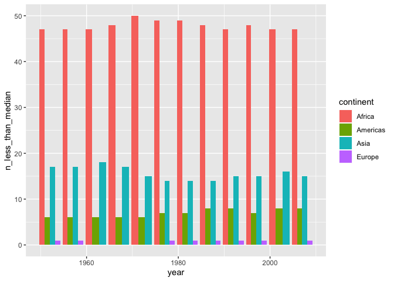
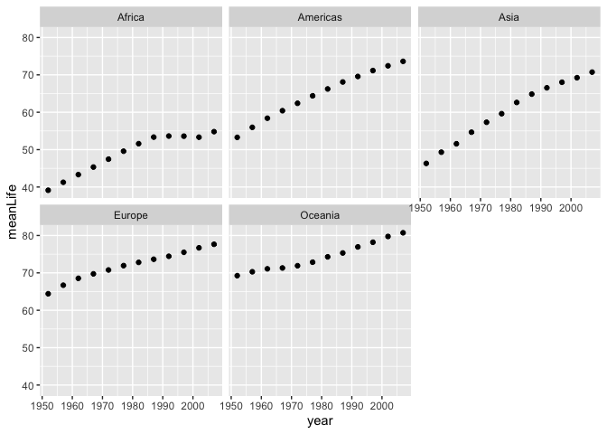

Hw03\_dplyr\_ggplot2\_Part\_II
================
Almas K.
2019-09-28

Task Option 2: Maximum and minimum of GDP per capita for all continents
-----------------------------------------------------------------------

``` r
gapminder %>%
   group_by(continent)  %>%
  summarize(max=max(gdpPercap),min=min(gdpPercap)) %>%
  print() %>%
  ggplot()
```

    ## # A tibble: 5 x 3
    ##   continent     max    min
    ##   <fct>       <dbl>  <dbl>
    ## 1 Africa     21951.   241.
    ## 2 Americas   42952.  1202.
    ## 3 Asia      113523.   331 
    ## 4 Europe     49357.   974.
    ## 5 Oceania    34435. 10040.



Task Option 5: How is life expectancy changing over time on different continents?
---------------------------------------------------------------------------------

``` r
gapminder %>%
   group_by(continent,year)  %>%
  arrange(year) %>%
  summarize(meanLife= mean(lifeExp)) %>%
print() %>%
  ggplot(aes( x=year,y=meanLife)) + 
  geom_point()+
  facet_wrap(. ~continent) 
```

    ## # A tibble: 60 x 3
    ## # Groups:   continent [5]
    ##    continent  year meanLife
    ##    <fct>     <int>    <dbl>
    ##  1 Africa     1952     39.1
    ##  2 Africa     1957     41.3
    ##  3 Africa     1962     43.3
    ##  4 Africa     1967     45.3
    ##  5 Africa     1972     47.5
    ##  6 Africa     1977     49.6
    ##  7 Africa     1982     51.6
    ##  8 Africa     1987     53.3
    ##  9 Africa     1992     53.6
    ## 10 Africa     1997     53.6
    ## # … with 50 more rows

 The life expectancy of Europe and Oceania started off fairly high in the 1950s and increased to

Task Option 3 : Look at the spread of GDP per capita within the continents.
---------------------------------------------------------------------------

``` r
gapminder %>%
   group_by(continent)  %>%
mutate(log_gdpPercap= log(gdpPercap)) %>%
  select(continent,log_gdpPercap) %>%
  arrange(log_gdpPercap) %>%
 print() %>%
  ggplot(aes(x=log_gdpPercap)) +
  geom_density() +
   facet_wrap(. ~continent) 
```

    ## # A tibble: 1,704 x 2
    ## # Groups:   continent [5]
    ##    continent log_gdpPercap
    ##    <fct>             <dbl>
    ##  1 Africa             5.49
    ##  2 Africa             5.63
    ##  3 Africa             5.70
    ##  4 Africa             5.70
    ##  5 Africa             5.74
    ##  6 Africa             5.80
    ##  7 Asia               5.80
    ##  8 Africa             5.82
    ##  9 Africa             5.83
    ## 10 Africa             5.84
    ## # … with 1,694 more rows


