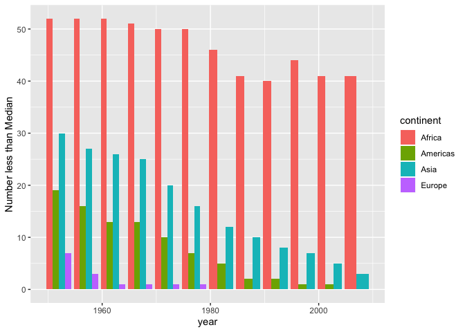
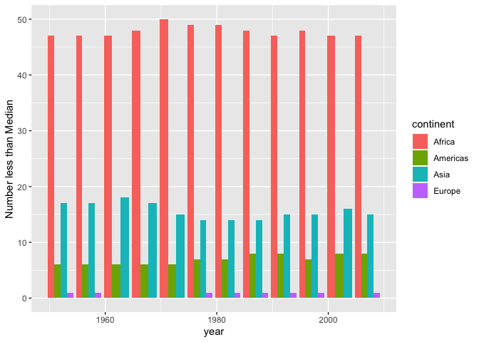
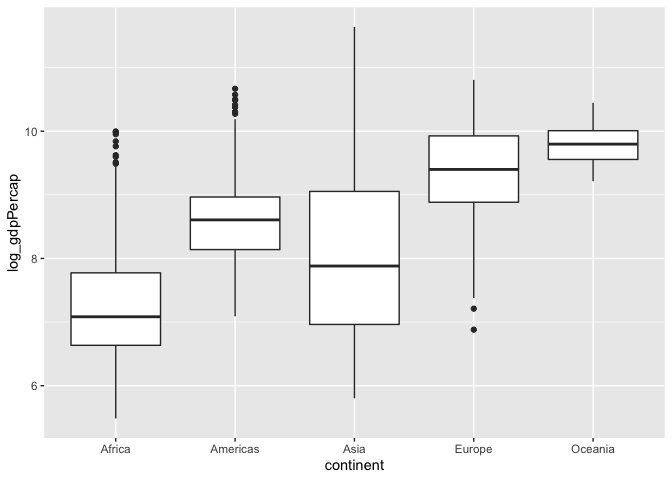
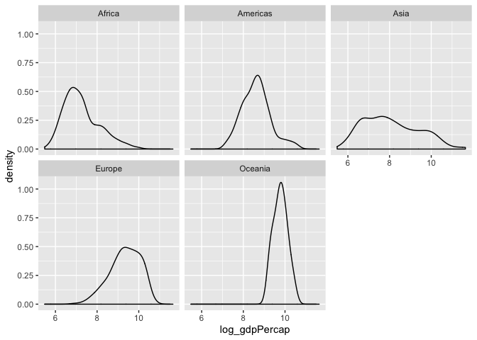
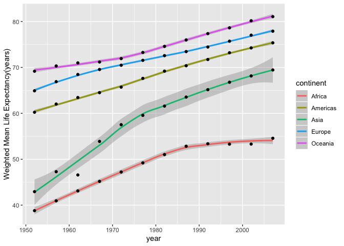

## Task Option 1: Median Life Expectancy Benchmark: 

 Report the absolute and/or relative abundance of countries with low life expectancy over time by continent: Compute some measure of worldwide life expectancy- I did this in 2 ways, both ways using the median life expectancy.I then determine how many countries on each continent have a life expectancy less than this benchmark, and visualized using a bar chart. 

### 1.1 Using Absolute Median as a Benchmark:

In this method, I took the absolute median life-expectancy using all years. This value was 60.7125 years.


```r
gapminder %>%
  mutate(median_lifeExp=median(lifeExp)) %>%
  mutate(less_than_median= if_else(lifeExp<median_lifeExp,TRUE,FALSE)) %>% 
  filter (less_than_median==TRUE) %>%
  group_by(continent,year,less_than_median) %>%
  summarize(n_less_than_median=sum(less_than_median)) %>%
  print() %>%
  ggplot(aes(x=year, y=n_less_than_median,group=continent))+
  geom_bar(aes(fill=continent),position="dodge",stat="identity")+
  ylab("Number less than Median")
```

```
## # A tibble: 41 x 4
## # Groups:   continent, year [41]
##    continent  year less_than_median n_less_than_median
##    <fct>     <int> <lgl>                         <int>
##  1 Africa     1952 TRUE                             52
##  2 Africa     1957 TRUE                             52
##  3 Africa     1962 TRUE                             52
##  4 Africa     1967 TRUE                             51
##  5 Africa     1972 TRUE                             50
##  6 Africa     1977 TRUE                             50
##  7 Africa     1982 TRUE                             46
##  8 Africa     1987 TRUE                             41
##  9 Africa     1992 TRUE                             40
## 10 Africa     1997 TRUE                             44
## # … with 31 more rows
```

<!-- -->

```r
## This postion dodge and stat identity part were used to help produce grouped bar charts next to each other and make it visually more appealing, learned this from: https://www.r-graph-gallery.com/48-grouped-barplot-with-ggplot2.html
```

This was a bit tricky to generate especially the bar graphs. Some trends that we can see are that in regards to the absolute median is that Africa has the most countries less than this benchmark.In fact, in the 60s it was all or almost all countries in the dataset. Europe has the greatest number of countries that meet or exceed this benchmark. Over time all of Europe's and the Americas' nations meet or exceed this threshold. 

### 1.2: Using Relative Median per Year as a Benchmark: 

In this method, I took the median life expectancy for each year for the world  and then calculated the number of countries for that year that had a life expectancy less than this. 


```r
gapminder %>%
  group_by(year) %>%
  mutate(median_lifeExp=median(lifeExp)) %>%
  ungroup(year) %>%
  mutate(less_than_median= if_else(lifeExp<median_lifeExp,TRUE,FALSE)) %>%
  filter (less_than_median==TRUE) %>%
  group_by(continent,year,less_than_median) %>%
  summarize(n_less_than_median=sum(less_than_median)) %>%
  print() %>%
  ggplot(aes(x=year, y=n_less_than_median,group=continent))+
  geom_bar(aes(fill=continent),position="dodge",stat="identity")+
  ylab("Number less than Median")
```

```
## # A tibble: 44 x 4
## # Groups:   continent, year [44]
##    continent  year less_than_median n_less_than_median
##    <fct>     <int> <lgl>                         <int>
##  1 Africa     1952 TRUE                             47
##  2 Africa     1957 TRUE                             47
##  3 Africa     1962 TRUE                             47
##  4 Africa     1967 TRUE                             48
##  5 Africa     1972 TRUE                             50
##  6 Africa     1977 TRUE                             49
##  7 Africa     1982 TRUE                             49
##  8 Africa     1987 TRUE                             48
##  9 Africa     1992 TRUE                             47
## 10 Africa     1997 TRUE                             48
## # … with 34 more rows
```

<!-- -->

Using this measure Africa still has the most countries in all the years that are less the relative median. In fact, the gap is pronounced as life-expectancies get larger. Comparing Africa for the relative in 2007, you see 47 countries that are below this threshold while for the absolute in 1.1 only 41 countries are below this threshold. Also interesting to note the trend in Europe having no countries below the relative threshold from the 60s to about the 70s, and then having some countries below this threshold onward. 

## Task Option 3 : Look at the spread of GDP per capita within the continents.

### 3.1 Table for spread:
Let's look at the the spread of GDP per capita first using the minimum, maximum, standard deviation and interquartile range. 

```r
gdp_spread <- gapminder %>%
   group_by(continent)  %>%
mutate(log_gdpPercap= log(gdpPercap)) %>%
  arrange(log_gdpPercap)
gdp_spread %>%
  summarize(min(gdpPercap),
            max(gdpPercap),
            sd(gdpPercap),
            IQR(gdpPercap))
```

```
## # A tibble: 5 x 5
##   continent `min(gdpPercap)` `max(gdpPercap)` `sd(gdpPercap)`
##   <fct>                <dbl>            <dbl>           <dbl>
## 1 Africa                241.           21951.           2828.
## 2 Americas             1202.           42952.           6397.
## 3 Asia                  331           113523.          14045.
## 4 Europe                974.           49357.           9355.
## 5 Oceania             10040.           34435.           6359.
## # … with 1 more variable: `IQR(gdpPercap)` <dbl>
```

This produces a tibble of 5 rows that show the spread of the GDP per capita. It already looks like the spread between Asia appears large, while Africa has the lowest minimums and maximums of the 5 continents. 

Next, Let's look at a box plot and density plot for spread:

### 3.2 : Density Plot and Box plot for gdpPerCapita

```r
gdp_spread %>%
  ggplot(aes(y=log_gdpPercap,x=continent)) +
  geom_boxplot() 
```

<!-- -->

```r
gdp_spread %>%
  ggplot(aes(x=log_gdpPercap)) +
  geom_density() +
   facet_wrap(. ~continent) 
```

<!-- -->


The distribution is right skewed for Africa, left-skewed for Europe, mostly normal for the Americas and Oceania, and it is interesting to note that the Americas and Oceania are mostly normally distributed. As predicted the spread between Asia is large and not normal. The boxplots show that Asia has larger variability and that the Americas look mostly symmetric.The median for Oceania is the highest and median gdp for Africa appears to be lower than the other samples.  

## Task Option 4: Compute a weighted mean of life expectancy for different years, weighting by population. 

We will produce a table given the means of life-expectancy and a scatterplot:

```r
gapminder %>%
   group_by(continent,year)  %>%
  summarize(wt_mean=weighted.mean(lifeExp,pop,na.rm = TRUE)) %>%
  print() %>%
  ggplot(aes(x=year,y=wt_mean)) +
  geom_smooth(aes(colour=continent))+
  geom_point()+
  ylab("Weighted Mean Life Expectancy(years)")
```

```
## # A tibble: 60 x 3
## # Groups:   continent [5]
##    continent  year wt_mean
##    <fct>     <int>   <dbl>
##  1 Africa     1952    38.8
##  2 Africa     1957    40.9
##  3 Africa     1962    43.1
##  4 Africa     1967    45.2
##  5 Africa     1972    47.2
##  6 Africa     1977    49.2
##  7 Africa     1982    51.0
##  8 Africa     1987    52.8
##  9 Africa     1992    53.4
## 10 Africa     1997    53.3
## # … with 50 more rows
```

```
## `geom_smooth()` using method = 'loess' and formula 'y ~ x'
```

<!-- -->

```r
## learned the idea of geom_smooth from a student: Marion Nyberg
```

The weighted life expectancy given population over time, showed that Asia had the greatest increase in life expectancy over time given the steepness of the line. The highest life-expectancy was in Oceania. All continents life-expectancies increased over time. The lowest life expectancy starting point was in Africa, and,although it increased over time, it appeared to plateau a bit from 1990 to 2000. 


