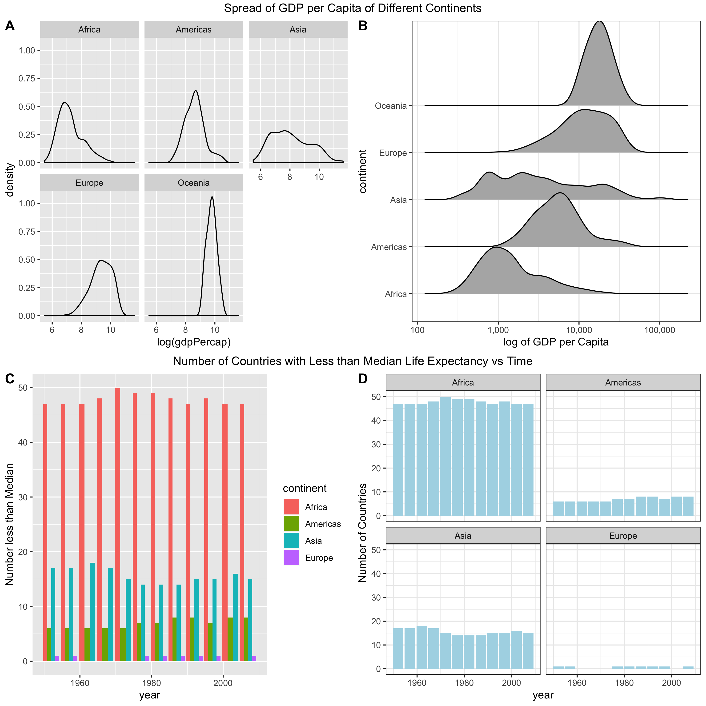

```{r load, warning=FALSE,echo=FALSE}
suppressPackageStartupMessages(library(tidyverse))
suppressPackageStartupMessages(library(gapminder))
suppressPackageStartupMessages(library(forcats))
suppressPackageStartupMessages(library(here))
suppressPackageStartupMessages(library(SDMTools))
suppressPackageStartupMessages(library(ggpubr))


```

# Exercise 1: Explain the value of the here::here package


The main value of the here::here package is based on the principle of reproducibility. It also allows the user to run their scripts in a platform agnostic manner and share scripts with others. The advantages of this package can be seen by comparing it to the commonly discouraged alternative setwd().Setwd relies on paths that are user specified but also very user , computer and time specific. Here::here on the other hand uses a specified order (or heuristics) to find the root directory, and thus for any computer it is run on, the correct path will be found.

 In Summary here::here:

1. Allows better collaboration and allows others to view and run your scripts on different platforms and not rely on user specific paths

2. Makes it easier to set paths without running into errors commonly seen when you use absolute or relative paths: 
  * if you use setwd with an absolute paths, you run the risk of not being able to run the script on another computer, at a different time, OS, or outside of R studio
  
* setwd is very specific to the user but here::here avoids this issue by using  an ordered method/set of directives that help it locate the root directory : 
    1) .here file(that it creates) --> if it can't find this then:
    2)  .Rproj --> if it can't find this then:
    3) looks for other file formats --> if it can't find these then:
    4) working directory as last resort
  
3. With these clear advantages in reproducibility, you can see its value!  
  
# Excercise 2: Factor Management- Using Gapminder:

We will be using the gapminder data set to explore factor management:


## 2.1 Drop Oceania:

### 2.1.1 Before the Drop:

Lets look at the factors in gapminder again before dropping Oceania 
```{r}
gapminder$continent %>% 
  levels()

gapminder$continent %>%
  nlevels 

gapminder %>% 
  str()

```

We see there are 5 levels in continent and 142 levels in country. There are 1704 rows 

### 2.1.2 After Dropping Oceania:
```{r}
gap_no_ocean <- gapminder %>%
  filter(!(continent=="Oceania")) 
str(gap_no_ocean) 

## Before dropping the unusued levels we see 142 levels in country and 5 levels in continent, that's not right! We have a lost continent, so we need to drop some levels.

gap_no_ocean <- gap_no_ocean %>%
  droplevels()
str(gap_no_ocean)

## Second time after dropping
```

See comment within code regarding before dropping levels.

As you can see the number of levels in continent dropped to 4, and number of countries dropped to 140 after removing the levels. Number of rows in both datasets was 1680, which is less than the original 1704. 

## 2.2 Reorder factors

Lets reorder our factor of country from Gapminder based on maximum gdp Per Capita.


### 2.2.1 Plots Before Reordering 
```{r}
gapminder %>%
  ggplot() +
  geom_col(aes(continent,max(gdpPercap)))+
  coord_flip()+
  theme_bw() +
  scale_y_continuous(labels=scales::comma)+
 ylab("GDP Per Capita") + xlab("Continent") +
   ggtitle("Before Reordering")

## Use a boxplot to visualized the spread and max gdp's we expect to see
gapminder %>%
  ggplot(aes(continent,gdpPercap))+
  geom_boxplot()+
  theme_bw() +
  scale_y_log10(labels=scales::comma)+
 ylab("log GDP Per Capita") + xlab("Continent") +
   ggtitle("Before Reordering")


```

Based on the boxplot we predict that we will see Asia as the highest max gdp (upper most whisker) and Africa as the lowest max gdp (upper most whisker is smaller here)

Now let's create plots based on rearranging the data for each continent based on max gdp and let's also directly plot the rearranged max gdp table and see if our plot is ordered in the same order as the table.

### 2.2.3 Creating the arranged table and plotting it 
```{r}
## Let's find the maximum gdp per continent and arranged by those
arranged_gdp <- gapminder %>%
  group_by(continent) %>%
  summarize(maxgdp=max(gdpPercap)) %>%
  arrange(desc(maxgdp))

arranged_gdp %>% knitr::kable()

arranged_gdp %>%
  ggplot() +
  geom_col(aes(continent,maxgdp))+
  coord_flip()+
  theme_bw() +
  ylab( "GDP per Capita") + xlab("Continent") +
  ggtitle("Using Arrange")

```

The continents are arranged correctly by max gdp in the table but not on the plot. They are instead in alphabetical order on the plot. Arrange therefore does not affect the plotting or reorder the levels.

What about if we use fct_reorder?

### 2.2.4 Plotting using the fct_reorder(forcats)
```{r}

## plot_oder_max_gdp is in the same order as the grouped and arranged table aka arranged_gap

plot_order_max_gdp <- arranged_gdp %>%
  ggplot() +
  geom_col(aes(y=maxgdp, x=fct_reorder(continent,maxgdp)))+ 
  coord_flip()+
  theme_bw() +
  ylab("GDP per Capita") + xlab("Continent") +
  ggtitle("Ordered based on Maximum GDP per Continent")
plot_order_max_gdp

 

## https://ggplot2.tidyverse.org/reference/geom_bar.html Ref for geom_col
## https://stat545.com/factors-boss.html --> learned how to plot bar graphs
## https://cmdlinetips.com/2019/02/how-to-reorder-a-boxplot-in-r/ how to reorder a boxplot

```

The plot is ordered correctly based on maximum gdp when factor reorder was used. Interesting notes about the plot: max gdp is highest in Asia, lowest in Africa

### 2.2.5 Comparing the order of levels from fct_reorder and arrange

```{r}
## Before Reordering
levels(arranged_gdp$continent)

##Using Factor Reorder
arranged_gdp$continent <- fct_reorder(arranged_gdp$continent,arranged_gdp$maxgdp)
levels(arranged_gdp$continent)
```

As you can see arrange only changes how they are viewed in a table, while fct_reorder actually changes the order of the levels in the factor, as seen in both the plot and the levels() function ,in this case in ascending order from left to right from smallest to greatest maximal gdp(ascending order). On the other hand, the original arranged_gdp levels are in alphabetical order.

# Exercise 3:File Input/output (I/O)

## 3.1 Create and Save New Data Set

### 3.1.1 Create a new dataset using Gapminder

Let's create a data set that stores the continent and the weighted mean of gdp per Capita with population, weighted standard deviation, and mean and sd of life Expectancy. 
```{r}

gap_wtgdp_meanlife <- gapminder %>%
  group_by(continent) %>%
  summarize(wt.mean(gdpPercap,pop),wt.sd(gdpPercap,pop),mean(lifeExp),sd(lifeExp))

gap_wtgdp_meanlife

## Used SDMTools Package
```

### 3.1.2 Save Dataset 
```{r}
write_csv(gap_wtgdp_meanlife,here("Hw05","Gapminder_WT_GDP_Mean_Life.csv"))
```

## 3.2 Reading in and Playing with Factors

### 3.2.1 Reading in and Viewing the Previously Saved Dataset
```{r}
Gapminder_read_in <- read_csv(here("HW05","Gapminder_WT_GDP_Mean_Life.csv")) 
```
After reading in using the default setting read_csv setting, the factor continent has changed to a class of type character, 

### 3.2.2 Converting Continent back to factor
```{r}
## Let's convert continent back into a factor first
Gapminder_read_in$continent <- as_factor(Gapminder_read_in$continent)
class(Gapminder_read_in$continent)

```
### 3.2.3 Exploring Factor Rearrangement by Weighted GDP per Capita
```{r}
##  Let's reorder our factors, first by the weighted gdp Per Capita

## First let's try if just using fct_reorder is enough for the table:
Gapminder_read_in$continent <- fct_reorder(Gapminder_read_in$continent,Gapminder_read_in$`wt.mean(gdpPercap, pop)`)

Gapminder_read_in
## No

## Have to use arrange
gapreadin_wt<- Gapminder_read_in %>%
  arrange(desc(`wt.mean(gdpPercap, pop)`))
gapreadin_wt


gapreadin_wt %>%
  ggplot() +
  geom_col(aes(y=`wt.mean(gdpPercap, pop)`, x=fct_reorder(continent,`wt.mean(gdpPercap, pop)`)))+ 
  coord_flip()+
  theme_bw() +
  ylab("Weighted GDP per Capita") + xlab("Continent") +
  ggtitle("Ordered based on  GDP per Capita Weighted by Population")
```

Learned that using fct_reorder does not arrange the factors in the correct order in a table, arrange is what you have to use. Interestingly Oceania has highest weighted GDP per capita whereas Asia and Africa are lower. 

## 3.2.3 Let's Explore Some other rearrangements:
```{r}
## sd gdp per capita
gapreadin_sd_wtgdp<- Gapminder_read_in %>%
  arrange(desc(`wt.sd(gdpPercap, pop)`))

gapreadin_sd_wtgdp %>%
  ggplot() +
  geom_col(aes(y=`wt.sd(gdpPercap, pop)`, x=fct_reorder(continent,`wt.sd(gdpPercap, pop)`)))+ 
  coord_flip()+
  theme_bw() +
  ylab("Weighted Standard Deviation of GDP per Capita") + xlab("Continent") +
  ggtitle("Ordered based on Standard Deviation of Weighted by Population- GDP")

## sd of mean Life Expectancy
gapreadin_sd_lifeExp<- Gapminder_read_in %>%
  arrange(desc(`sd(lifeExp)`))

gapreadin_sd_lifeExp %>%
  ggplot() +
  geom_col(aes(y=`sd(lifeExp)`, x=fct_reorder(continent,`sd(lifeExp)`)))+ 
  coord_flip()+
  theme_bw() +
  ylab("Standard Deviation of Life Expectancy") + xlab("Continent") +
  ggtitle("Ordered based on Standard Deviation of Life Expectancy By Continent")
```

Interesting to note how order changes based on what standard deviation is used. 

# 4.0 Visualization

In assignment 3, I originally created a facet wrapped side by side histogram to compare spread of gdp Per capita. This made comparing the spreads of different continents with each other a bit more difficult. It also had no title. A peer reviewer recommended using geom_ridge to create a ridge plot. I have done this below.

## 4.1 Spread Plots 

### 4.1.1 Original Density Plot
Let's view the original 
```{r}
## Original
density_gdpPercap <- gapminder%>%
  ggplot(aes(x=log(gdpPercap))) +
  geom_density() +
   facet_wrap(. ~continent) 
density_gdpPercap

```


### 4.1.2 New Ridge Plot and both plots side by side 

Let's view an updated ridge plot and compare the both types of plots.
```{r}

ridge_gdpPercap <- gapminder%>%
  ggplot(aes(y=continent,x=gdpPercap)) +
  scale_x_log10(labels=scales::comma)+
  ggridges::geom_density_ridges(aes(y=continent))+
  xlab("log of GDP per Capita")+
  theme_bw()

ridge_gdpPercap+
  ggtitle("Spread of GDP per Capita of Different Continents")

## Plotting side by side 
density_plots <- ggarrange(density_gdpPercap,ridge_gdpPercap,labels="AUTO") %>%
annotate_figure(top="Spread of GDP per Capita of Different Continents")
density_plots


## Learned about ggarrange from :http://www.sthda.com/english/wiki/print.php?id=177
## Common title learned fr. : https://stackoverflow.com/questions/49825971/add-a-common-legend
```

The ridge plot(B) makes it much easier to compare the spreads of different continents on one plot and makes it easier to see trends compared to the original(A) .

The difference: 

  * Included a title in updated graph
  * Axes make more sense now
  * Easier to compare the spread acrross different continents in 1 plot compared to the 5 original

I didn't add a title to the original plot objects before plotting side by side because the objects kept getting cut off. 


## 4.2 Grouped Bar charts:

Also in assignment 3, I created group bar charts to look at the number of countries that are below the global median.Jenny Bryan mentions that grouped bar charts make it harder to see trends between items that are not close to each other, she does not recommend grouped bar charts on her stat 545 page.

Source: https://stat545.com/effective-graphs.html

### 4.2.1 Create an object of the original code 

This was used to generate the initial graph, it will save typing and make code cleaner to create an object from this code: 

```{r}
gap_median <- gapminder %>%
  group_by(year) %>%
  mutate(median_lifeExp=median(lifeExp)) %>%
  ungroup(year) %>%
  mutate(less_than_median= if_else(lifeExp<median_lifeExp,TRUE,FALSE)) %>%
  filter (less_than_median==TRUE) %>%
  group_by(continent,year,less_than_median) %>%
  summarize(n_less_than_median=sum(less_than_median)) 
```

### 4.2.2 Generate the Original Grouped Bar chart 

```{r}
grouped_bar <- gap_median %>%
  ggplot(aes(x=year, y=n_less_than_median,group=continent))+
  geom_bar(aes(fill=continent),position="dodge",stat="identity")+
  ylab("Number less than Median")
grouped_bar
```

In the case above, yes it is difficult to compare the continents with each other over time. 

### 4.2.3 New Facet Wrapped Bar Chart and Both bar graphs side by side

Claus O. Wilke in his book Fundamentals of Data Visualization also mentions grouped bar charts are confusing and cautions against them. He recommends faceted wrapped bar charts. 
Source(https://serialmentor.com/dataviz/visualizing-amounts.html#visualizing-amounts)

I followed his recommendation and created a new facet wrap bar chart and then put both bar charts side by side.

```{r}
facet_wrap_bar <- gap_median %>%
  ggplot(aes(x=year, y=n_less_than_median,group=continent))+
  geom_col(fill="light blue")+
  ylab("Number of Countries")+
  facet_wrap(.~continent)+
  theme_bw() 
facet_wrap_bar +
   ggtitle("Number of Countries with Less than Median Life Expectancy vs Time")

bar_less_med <- ggarrange(grouped_bar,facet_wrap_bar,labels = c("C","D")) %>%
  annotate_figure(top="Number of Countries with Less than Median Life Expectancy vs Time")
bar_less_med


```

Observations: 
The facet wrapped bar chart(D) makes it much easier to compare the number of countries in each continent over time that was less than the median.It also makes it easier to see trends compared to the original(C),like for example, Africa has the greatest number of countries with less than median over time.Also  Oceania is not present in both graphs, but this is more obvious in D, meaning it has never had a country with less than the median life Expectancy, and other trends are also present. 

The difference: 

  * Included a title in updated graph
  * Y axis is more clearly labelled 
  * Easier to compare the numbers acrross different continents when looking at the faceted plots.


# 5.0 Save Visualizations


Let's save all 4 plots from 4.0 above as one plot. 
     
## 5.1.1 Let's Combine the 4 plots Generated in Part 4

```{r}

four_plots <- ggarrange(density_plots,bar_less_med,nrow=2,ncol=1)
```

## 5.1.2 Let's save all the plots as one big plot
```{r}

ggsave(here("HW05","Combined_Gapminder_Plots.png"), four_plots,width=10,height=10)
 
```

## 5.1.3 Let's embed this big plot here:

Here are the 4 plots I created in part 4. 



