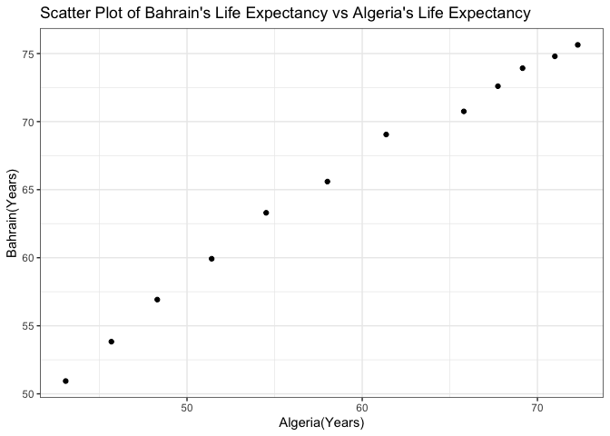

---


# Exercise 1: Univariate Data Reshaping

## Univariate Option 1:Life Expectancy vs Year

### 1.1 Data in Wider Format
Let's choose 2 other countries to compare to Canada 

```r
gapwide <- gapminder %>% 
  filter((country=="Algeria")|(country=="Bahrain")|(country=="Canada")) %>%
  pivot_wider(id_cols= year, 
              names_from= country,
              values_from = lifeExp)
print(gapwide)
```

```
## # A tibble: 12 x 4
##     year Algeria Bahrain Canada
##    <int>   <dbl>   <dbl>  <dbl>
##  1  1952    43.1    50.9   68.8
##  2  1957    45.7    53.8   70.0
##  3  1962    48.3    56.9   71.3
##  4  1967    51.4    59.9   72.1
##  5  1972    54.5    63.3   72.9
##  6  1977    58.0    65.6   74.2
##  7  1982    61.4    69.1   75.8
##  8  1987    65.8    70.8   76.9
##  9  1992    67.7    72.6   78.0
## 10  1997    69.2    73.9   78.6
## 11  2002    71.0    74.8   79.8
## 12  2007    72.3    75.6   80.7
```
### 1.2 Scatter Plot for 2 countries against each other:

Let's choose Algeria and Bahrain to plot against each other.

```r
gapwide %>%
  ggplot(aes(x=Algeria, y=Bahrain))+
  geom_point()+
  theme_bw()
```

<!-- -->
Over time, life Expectancy of Bahrain is higher compared to Algeria 
### 1.3 Relengthen Data:

```r
gapwide %>%
  pivot_longer(cols = c(-year),
               names_to = "Country",
               values_to="Life Expectancy")
```

```
## # A tibble: 36 x 3
##     year Country `Life Expectancy`
##    <int> <chr>               <dbl>
##  1  1952 Algeria              43.1
##  2  1952 Bahrain              50.9
##  3  1952 Canada               68.8
##  4  1957 Algeria              45.7
##  5  1957 Bahrain              53.8
##  6  1957 Canada               70.0
##  7  1962 Algeria              48.3
##  8  1962 Bahrain              56.9
##  9  1962 Canada               71.3
## 10  1967 Algeria              51.4
## # … with 26 more rows
```

# Excercise 2: Multivariate Data Reshaping:

## Multivariate Option 1: Life Expectancy-Gdp

### 2.1 Wide Tibble

```r
gap_mulit_wide <- gapminder %>%
filter(country== "Australia"| country == "Bahrain") %>%
  pivot_wider(id_cols = year,
              names_from = country,
              values_from = c(lifeExp,gdpPercap))
print(gap_mulit_wide)
```

```
## # A tibble: 12 x 5
##     year lifeExp_Austral… lifeExp_Bahrain gdpPercap_Austr… gdpPercap_Bahra…
##    <int>            <dbl>           <dbl>            <dbl>            <dbl>
##  1  1952             69.1            50.9           10040.            9867.
##  2  1957             70.3            53.8           10950.           11636.
##  3  1962             70.9            56.9           12217.           12753.
##  4  1967             71.1            59.9           14526.           14805.
##  5  1972             71.9            63.3           16789.           18269.
##  6  1977             73.5            65.6           18334.           19340.
##  7  1982             74.7            69.1           19477.           19211.
##  8  1987             76.3            70.8           21889.           18524.
##  9  1992             77.6            72.6           23425.           19036.
## 10  1997             78.8            73.9           26998.           20292.
## 11  2002             80.4            74.8           30688.           23404.
## 12  2007             81.2            75.6           34435.           29796.
```

### 2.2 Relengthen Data:

```r
gap_mulit_wide %>%
  pivot_longer(cols=c(-year),
               names_to = c(".value", "country"),
               names_sep = "_")
```

```
## # A tibble: 24 x 4
##     year country   lifeExp gdpPercap
##    <int> <chr>       <dbl>     <dbl>
##  1  1952 Australia    69.1    10040.
##  2  1952 Bahrain      50.9     9867.
##  3  1957 Australia    70.3    10950.
##  4  1957 Bahrain      53.8    11636.
##  5  1962 Australia    70.9    12217.
##  6  1962 Bahrain      56.9    12753.
##  7  1967 Australia    71.1    14526.
##  8  1967 Bahrain      59.9    14805.
##  9  1972 Australia    71.9    16789.
## 10  1972 Bahrain      63.3    18269.
## # … with 14 more rows
```

```r
## .value separates values for the measures of lifeExp and gdpPerCap
```

# Excercise 3.0 Table Joins:

### Loading the guest and email data

```r
guest <- read_csv("https://raw.githubusercontent.com/STAT545-UBC/Classroom/master/data/wedding/attend.csv")
```

```
## Parsed with column specification:
## cols(
##   party = col_double(),
##   name = col_character(),
##   meal_wedding = col_character(),
##   meal_brunch = col_character(),
##   attendance_wedding = col_character(),
##   attendance_brunch = col_character(),
##   attendance_golf = col_character()
## )
```

```r
email <- read_csv("https://raw.githubusercontent.com/STAT545-UBC/Classroom/master/data/wedding/emails.csv")
```

```
## Parsed with column specification:
## cols(
##   guest = col_character(),
##   email = col_character()
## )
```
###  3.1.1 First Edit email csv:
Each guest should on one line for each email and guest field changed to name to make it easier to join


```r
Email <- email %>%
  separate_rows(email,guest, sep = ",") %>%
  select(name=guest,email) %>%
 mutate(name=trimws(name, "both"))

## There is a white space in Email dataset 
```

## 3.1 Add Emails for Each Guest on List:

Including emails only for those on the guest dataset (no additonal emails):

```r
guest_emails <- Email %>%
  inner_join(guest,Email, by="name") %>%
print(guest_emails)
```

```
## # A tibble: 25 x 8
##    name  email party meal_wedding meal_brunch attendance_wedd…
##    <chr> <chr> <dbl> <chr>        <chr>       <chr>           
##  1 Somm… somm…     1 PENDING      PENDING     PENDING         
##  2 Phil… somm…     1 vegetarian   Menu C      CONFIRMED       
##  3 Blan… somm…     1 chicken      Menu A      CONFIRMED       
##  4 Emaa… somm…     1 PENDING      PENDING     PENDING         
##  5 Blai… bpar…     2 chicken      Menu C      CONFIRMED       
##  6 Nige… bpar…     2 <NA>         <NA>        CANCELLED       
##  7 Sine… sing…     3 PENDING      PENDING     PENDING         
##  8 Ayra… mark…     4 vegetarian   Menu B      PENDING         
##  9 Jole… jw19…     6 <NA>         <NA>        CANCELLED       
## 10 Hayl… jw19…     6 vegetarian   Menu C      CONFIRMED       
## # … with 15 more rows, and 2 more variables: attendance_brunch <chr>,
## #   attendance_golf <chr>
```

## 3.2 Emails but not on Guest List

The names of peoples with emails but are not on guest list:


```r
guest_emails %>%
  select(name,email) %>%
  setdiff(Email,.)
```

```
## # A tibble: 3 x 2
##   name            email                          
##   <chr>           <chr>                          
## 1 Turner Jones    tjjones12@hotmail.ca           
## 2 Albert Marshall themarshallfamily1234@gmail.com
## 3 Vivian Marshall themarshallfamily1234@gmail.com
```

## 3.3 Guest List for all those that we have emails for:

A new guest list with names of people on the original guest list with emails and those not on the original guest list who also have emails 


```r
guest_all_emails <- Email %>%
  left_join(guest,Email, by="name") %>%
print(guest_emails)
```

```
## # A tibble: 28 x 8
##    name  email party meal_wedding meal_brunch attendance_wedd…
##    <chr> <chr> <dbl> <chr>        <chr>       <chr>           
##  1 Somm… somm…     1 PENDING      PENDING     PENDING         
##  2 Phil… somm…     1 vegetarian   Menu C      CONFIRMED       
##  3 Blan… somm…     1 chicken      Menu A      CONFIRMED       
##  4 Emaa… somm…     1 PENDING      PENDING     PENDING         
##  5 Blai… bpar…     2 chicken      Menu C      CONFIRMED       
##  6 Nige… bpar…     2 <NA>         <NA>        CANCELLED       
##  7 Sine… sing…     3 PENDING      PENDING     PENDING         
##  8 Ayra… mark…     4 vegetarian   Menu B      PENDING         
##  9 Jole… jw19…     6 <NA>         <NA>        CANCELLED       
## 10 Hayl… jw19…     6 vegetarian   Menu C      CONFIRMED       
## # … with 18 more rows, and 2 more variables: attendance_brunch <chr>,
## #   attendance_golf <chr>
```

There are 5 guests who don't have emails in the email tibble. Let's find out who those 5 guests are: 
### 5 Guests on original guest list without any email

```r
guest_emails%>%
  select(-email) %>%
  setdiff(guest,.)
```

```
## # A tibble: 5 x 7
##   name  party meal_wedding meal_brunch attendance_wedd… attendance_brun…
##   <chr> <dbl> <chr>        <chr>       <chr>            <chr>           
## 1 Atla…     5 PENDING      PENDING     PENDING          PENDING         
## 2 Denz…     5 fish         Menu B      CONFIRMED        CONFIRMED       
## 3 Chan…     5 chicken      Menu C      CONFIRMED        CONFIRMED       
## 4 Cosm…    10 PENDING      PENDING     PENDING          PENDING         
## 5 Cai …    11 fish         Menu C      CONFIRMED        CONFIRMED       
## # … with 1 more variable: attendance_golf <chr>
```

